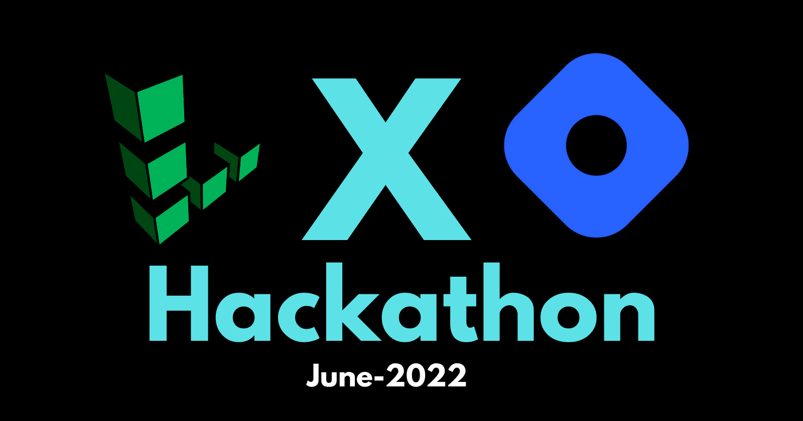

# Build with Linode Hackathon (Linode X Hashnode) — June 2022
  
  

### Project Task

**To Build an exciting open-source app of your choice using Linode and its products during the whole of June. Publish an article on your Hashnode blog about the process of creating and launching your app for a chance to win one of the 15 cash prizes and swags!**

[Live Demo URL](https://devtree.link)


### Project Overview

It consits of :

* Header
* Hero Section
* Settings Page
* Links Page
* Community Chat Section
* My Profile Page
* Footer

and many more components...

### Languages/Framework Used

* HTML5
* CSS3
* Java Script
* React.js
* Next.js
* Tailwind CSS

### Backend Resources Used

* Moralis.io (Web3 Provider)
* Supabase.io (PostgreSQL DB)

### UI Resources Used

* Images - (Google Images)
* SVG Icons - (Heroicons)
* Fonts- (Google fonts)


### How to use/create a profile on devtree.link

1.First, visit the devtree.link , and use your Metamask wallet to connect to the Dapp.

2.Then, go to Settings Tab and change your Username.

3.Go to Links Tab and add your Social/Dev Profile Links.

4.Update your Image in the Settings Tab.

5.Visit My Profile Tab to see your Devtree.

6.Share your Devtree profile link with others.


### The Code

Steps to run the app locally:


#### Step-1: Git Clone the project

```bash
   git clone https://github.com/raiv200/devtree-link.git
```

#### Step-2: Install the dependencies

```bash
  npm install
```

#### Step-3: Create a .env.local file and add these 4 environment variables

```bash

NEXT_PUBLIC_APP_ID=" "

NEXT_PUBLIC_SERVER_URL=" "

NEXT_PUBLIC_SUPABASE_URL=" "

NEXT_PUBLIC_SUPABASE_ANON_KEY=" "

```


#### Step-4: Create an account on Moralis.io and Supabase.io and get the environment variables.

You can get the first two environment variable  by creating project on moralis.io.

1. After creating  project, you will see, a settings tab.
2. Click on the settings tab , and the you will see DappCredentials.
3. Copy Dapp URL and Paste in between the quotes of NEXT_PUBLIC_SERVER_URL.
4. Then Copy Application URL and Paste in between the quotes of NEXT_PUBLIC_APP_ID.

And that's it for the Moralis Part.

And the next two environment variable  by creating account on Supabase.io.

1. After creating  account, you will see a dashboard and you were asket to create a project, you can name it anything.

2. You will see some icons on the left side menu , one of them will be a settings icon, click on it and then you will see the API tab, click on it and grab you credentials

Copy the Project URL and the Anon Key and paste it in the environment variables.

3. Now, Click on database icon , which will on the left side menu .

4. After that click on the Table tab and create a new table, just fill the (Name of the Table ) and the Description Field) and save it.

5. Then go to Table Editor, and inside that add columns to the table.
  
    Add these  column one by one:

                  1. userName - type(Varchar)
                  2. ethAddress - type(Varchar)
                  3. blogLink - type(Varchar)
                  4. portfolioLink- type(Varchar)
                  5. githubLink - type(Varchar)
                  6. twitterLink- type(Varchar)
                  7. linkedinLink- type(Varchar)
                  8. sponsormeLink- type(Varchar)
                  9. imageUrl- type(Varchar)

Now you Database is ready.

#### Step-5: Start the development server

Now open your project in your favorite IDE , (VsCode) and then start the development server.

```bash
   npm run dev
```

> Note: In Production mode , you need to one more thing, Go to the ShareButton.jsx componennt and edit the URL constant with your Website URL link.
